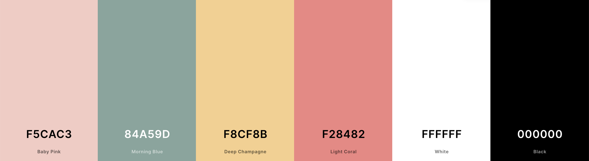

# Class Portal, Milestone 1 Process

For my class portal, I was inspired by a wireframe I created for a hand coded portfolio that I never got around to making. I really loved the design I came up with but didn’t have the time to hand code this portfolio in time for applying to internships. However, when I came across it when I starting this project, I was super excited and inspired that I would get to use these long lost ideas in a smaller project.

My class portal will use color blocking for its organization. The colors I picked are cheery yet slightly muted, making them subtle and not too overbearing in my design. As a designer, I think color blocking is a great option for organization because it can look professional but it is also fun and showcases color. Additionally, this organization adapts well between mobile and web application, because the blocks can just be sized up or down depending on the device, they do not need to be rearranged. 

