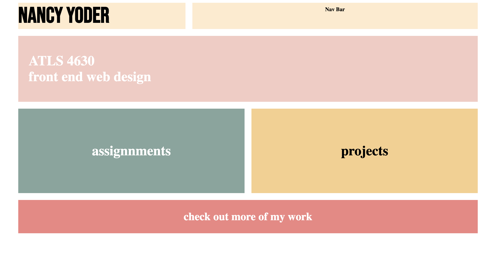
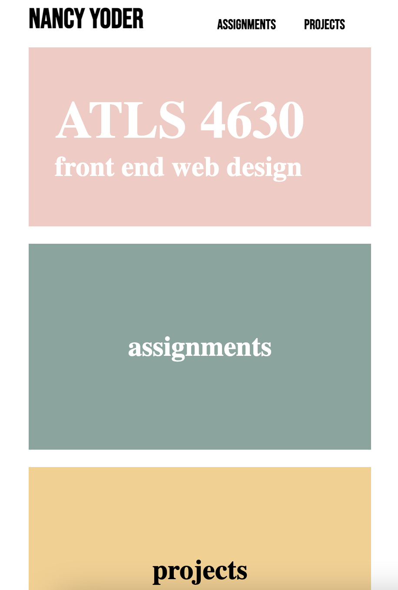
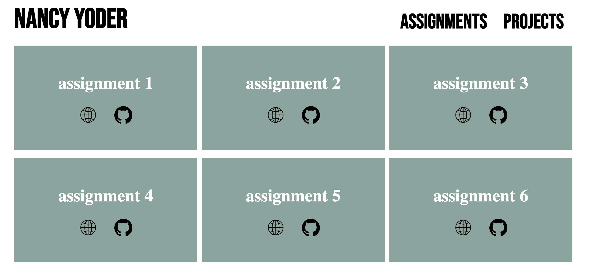

# Class Portal, Milestone 1 Process

For this project, I was tasked to design and code a website that will act as a class portal for Front End Web Development and link to all of the work I create in this class. My design is inspired by a wireframe I create for a hand coded portfolio that I never got around to making. I really loved the design I came up with but didn’t have enough time to hand code this portfolio in time for applying to internships. However, when I came across it when starting this project, I was super excited and inspired that I would get to use this long-lost idea in a smaller project.

My class portal will use color blocking for its organization. As a designer, I think color blocking is a great option for organization because it can look professional but is also fun and showcases color. Additionally, this organization adapts well between mobile and web applications because the blocks can just be sized up or down depending on the device. 

The colors I picked are cheery yet slightly muted, making them subtle and not too overbearing in my design. These colors create an interesting combination that is not seen too often but really represents me and my personality. Color is something that really inspired me when I design, and therefore I wanted to make it the focal point of my class portal. With using these bright colors, I will be careful not to take away from the actual projects I am uploading to my class portal. My plan is to make the headings of each page colorful, but the text and other elements will remain neutral.

The designs shown below are wireframes I created on Figma to showcase the home page of my class portal in both a web application and mobile application. In the web application, there is my logo as well as a nav bar for moving between the different pages I plan on creating. There is a pink heading which showcases the name of this class for users to reference for context. Below that are large buttons that will link to the different pages. Finally, there is a footer with links to my portfolio, email and GitHub. 

For the mobile application home page, it is similar to the web application, but I took out the nav bar. Starting at the top, we have my logo, the class title, and then the buttons for the different pages, which are laid out vertically. The same footer is at the bottom. 

The architecture of my site is pretty simple. The home page will link to the other 4 pages: labs, projects, process, and code. On the web application users can navigate via the nav bar and can get back to the home page by clicking my logo. For the mobile application, since I removed the nav bar for aesthetic reasons, I am going to see if a back button system will work here. The user will click on a page and exit it through a back button that will bring them to the home page. From there they can click to a different page. If this plan is clunky in practice, I will supplement a nav bar with a hamburger menu in the top right corner for navigation purposes. 

In order to make the mobile application wireframe, I created a frame that is the size of a phone screen, and then copied everything over from the web application, sizing it down as needed. In full transparency, I have never designed the front end of a website to be responsive based on-screen size, so I am slightly nervous to see if my plan (adjusting the size of all the different elements) will work. However, I am more than willing to adapt my design as necessary in order to make sure it works on all screen sizes. That being said, I am excited to continue learning in the second phase of this project and class!

# Class Portal, Milestone 2 Process

The first challenge I tackled in this project was how I was going to make it responsive between different devices and screen sizes. From here I started researching flex boxes and trying to get them right for the desired layout of my site. This took me quite a while because I haven’t worked with flex boxes for some time, but I eventually got something I was happy with and was able to continue on making the boxes the correct size with margins, padding, and font size. This took me a really long time as I am quite the perfectionist and wanted the site to look exactly like the wireframe I created, but I eventually had to let this go. 

A useful site that helped me relearn flex boxes is linked here:

[https://css-tricks.com/snippets/css/a-guide-to-flexbox/#aa-background](https://css-tricks.com/snippets/css/a-guide-to-flexbox/#aa-background)

The screenshot below is one of the early stages of my design. I have the cream color on the logo and nav bar to help me differentiate those divs. In the final design the logo and nav bar will have white backgrounds.

I ended up using the row wrap on the flex box. However, I used the @media function in CSS to change the “assignment” and “projects” boxes to be in a column instead of a row once the screen size is smaller width wise. I also changed the size of the font when the screen size was smaller to make sure everything fit perfectly on any screen size. 

In milestone 1 I didn’t think about how I wanted the projects and assignments pages to look, so during this milestone I had to design them. I ended up just going with the same color blocking pattern to keep the site uniform. I added in the website icon and the GitHub logo as buttons for the user to click on to view both of the elements for each assignment and project.

Once I had created all of the pages, I needed to link them together. One challenge I faced was the styling on the links. I had to use id to make sure all of the links were the correct color, because I wanted some of them to be white and some of them to be black.

The finishing touches were just moving the screen size around a lot and making sure everything looked good. One technique I had for this was adding color to containers to see where they truly were and how they were impacting formatting. Originally, I had the blue and yellow boxes on the first page as the same class as the blue and yellow boxes on the assignments and projects pages. However, through my trouble shooting process I found that the margins from the first page didn’t work for the other pages, and I had to make a new class for the boxes on each of the other pages. 

From this project I revamped my front-end web knowledge and skills. This project also taught me that I don’t need to be a perfectionist about everything. There are certain elements of this project that I wanted to make more perfect, but I wasn’t able to, and that’s okay because I really like how it turned out.

Check out my final class portal here:
https://nancyyoder.github.io/fwd-class-portal/
